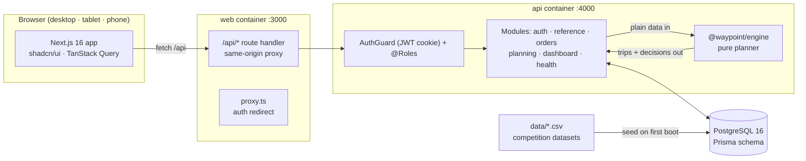
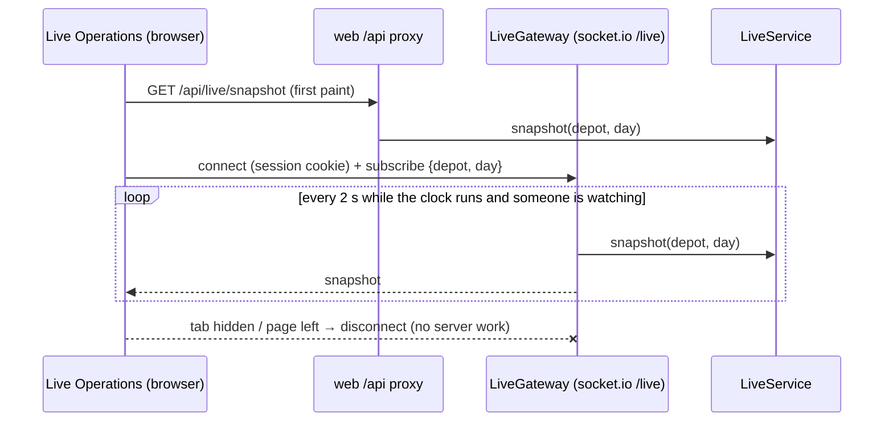
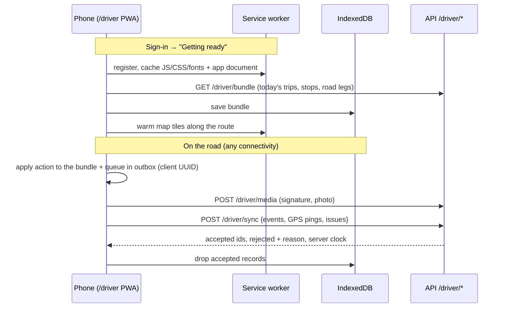

# Architecture

## Components

| Component | Responsibility |
|---|---|
| `apps/web` | Role workspaces. Every call goes through `/api`, a runtime proxy to the API, so the session cookie stays first-party and the API URL is set at runtime. |
| `apps/api` | NestJS REST API. A global JWT guard plus `@Roles()` handles authorization. Zod DTOs from `@waypoint/shared` validate requests. Planning writes are transactional and audit-logged. |
| `packages/engine` | Deterministic allocator, described below. No database or network access, so the dispatcher UI and the Datathon Task 2B CLI share the same code. |
| `packages/db` | Prisma schema, migrations, idempotent CSV seed and demo day. |
| `packages/shared` | Operating rules (budgets, cutoff), labels, DTOs and time utilities, shared by every layer. |

## Planning engine

1. **Score** every order. The score adds weights for: deferred on the last run, days since last served, chilled, brand urgency, festival ramp and payday. The breakdown is stored with each decision.
2. **Phase 1 (Fresh, 03:30–08:00, 270 min)** then **phase 2 (Style + Tech, trading day, 480 min)**, so one vehicle can run a Fresh trip and then a Style/Tech trip.
3. **Priority-first seeding.** The highest-scoring unplaced order seeds the next trip. For every vehicle, the engine builds the best trip containing it, filled from the same brand + district group. It keeps the trip with the highest value: priority served, minus penalties for using a reefer or van on loads that don't need one. Reefers seeded by a chilled order carry only chilled orders.
4. Every candidate stop is checked against:
   - capacity (weight and volume)
   - refrigeration and van-only access
   - home depot
   - time budget (Task 2B formula)
   - weekly fuel quota (round-trip km ÷ km/L)
   - the receiving window (outlet ∩ mall window, with waiting for early arrivals).
5. **Diagnose** each deferred order. The engine finds the binding constraint (reefer capacity, access, time, fuel, window, oversized order) and marks the deferral **unavoidable** or a **trade-off**.

The dispatcher can then assign or defer by hand. `validateTrip` re-checks the same rules on the server before any change is saved.

## Live operations

- **The WebSocket is only used where it improves the experience.** Only the Live Operations view opens a socket, and only while the tab is visible. The server computes snapshots only for rooms with subscribers, and only while the clock runs. Every other screen uses plain REST.
- **Positions come from a simulation for now.** `LiveService` replays the published plan, scaling travel by the district's `traffic_speed` (hour, monsoon) and `road_conditions` (date). This produces realistic delays, projected ETAs and window-miss alerts. Driver events (`DeliveryEvent`) will replace the simulated times once the driver app is in use.
- **Maps.** Google Maps renders with the Waypoint light/dark style arrays. Markers are React elements in an `OverlayView`, so they share the design system, and routes are polylines (travelled part solid, remaining part dotted). Without an API key, an SVG schematic renders the same data.

## Driver app (offline-first PWA)

- **Bundle, not pages.** The phone downloads one bundle with only what a driver acts on (stops, windows, access notes, items to hand over, road geometry). It excludes scores, weights, fuel quotas and other drivers' trips.
- **Local first.** Every action is applied to the local bundle immediately and queued in an IndexedDB outbox. Records carry client UUIDs (`DeliveryEvent.id`, `ProofOfDelivery.id`, `MediaAsset.id`, `Issue.clientId`, `DriverLocation.id`), so the server treats a replay as a no-op. Events keep the device's `occurredAt`; the server stores `receivedAt` separately.
- **Sync triggers.** Reconnect (`online`), after each action, on every GPS ping, every 20 s while anything is queued, and a 4-minute background refresh of the plan. Media upload first, because events cite them. The server asks the phone to retry (leaves the record queued) if a cited photo has not arrived yet.
- **GPS.** A ping is queued every `GPS_PING_SECONDS` (240) while a trip runs, and at each stop action. Web apps cannot track in the background, so the screen is kept awake during a trip. In `DEMO_MODE` the phone simulates movement along the road route.
- **Service worker.** The app document is network-first with a saved copy, `/_next/static` is cache-first, Mapbox style and tiles are cache-first. `/api` is never cached by the worker: the app owns its data. The worker's scope is `/driver`, so the dispatcher site is untouched.
- **Navigation.** `RoutingService` stores Mapbox turn-by-turn steps with each trip's road legs, and the bundle carries them, so guidance works from the planned leg with no signal. Online, the phone asks Mapbox Directions for a route from its position to the target (depot or stop), snaps its GPS to the route every fix, re-routes after repeated off-route fixes and speaks the next maneuver. In demo mode the simulated phone drives whichever route is being shown.
- **Claiming the trip.** `TRIP_DEPARTED` is only offered when the phone is within 300 m of the depot (or the driver confirms manually when GPS is unavailable); the event stores the fix.
- **Issue group chat.** `IssueChat` (one per issue) has `IssueChatMember`s (the people the issue affects: reporter, driver, loader, store managers) and `IssueChatMessage`s. Created when an issue is raised (older and machine-raised issues get theirs on first look, without notifications). Members post, the dispatcher reads, changes the issue status (system notes appear in the chat) and closes or reopens it; a closed chat refuses posts. Realtime reaches members and the desk through the `/chat` socket (`issue-chat:message`). The driver app queues chat messages in its outbox with a client id, like events and issues.
- **Live operations.** For a trip the driver has started, `LiveService` overlays the driver's reported stop statuses and latest `DriverLocation` on the replayed trip; other trips stay on the replay.
