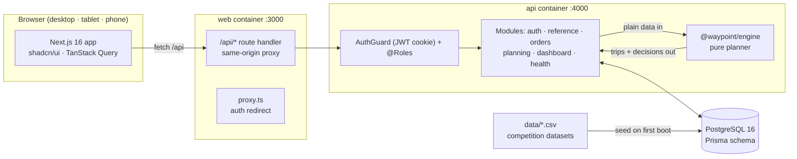
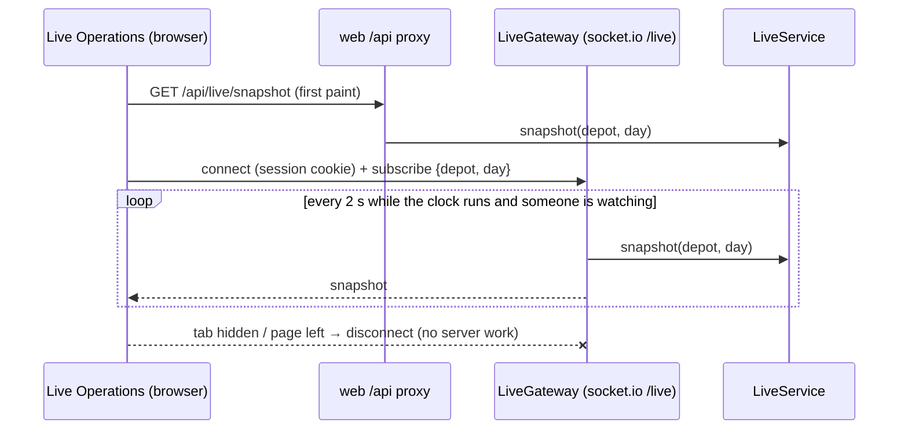

# Architecture

## Components

| Component | Responsibility |
|---|---|
| `apps/web` | Role workspaces. Every call goes through `/api`, a runtime proxy to the API, so the session cookie stays first-party and the API URL is set at runtime. |
| `apps/api` | NestJS REST API. A global JWT guard plus `@Roles()` handles authorization. Zod DTOs from `@waypoint/shared` validate requests. Planning writes are transactional and audit-logged. |
| `packages/engine` | Deterministic allocator, described below. No database or network access, so the dispatcher UI and the Datathon Task 2B CLI share the same code. |
| `packages/db` | Prisma schema, migrations, idempotent CSV seed and demo day. |
| `packages/shared` | Operating rules (budgets, cutoff), labels, DTOs and time utilities, shared by every layer. |

## Planning engine

1. **Score** every order. The score adds weights for: deferred on the last run, days since last served, chilled, brand urgency, festival ramp and payday. The breakdown is stored with each decision.
2. **Phase 1 (Fresh, 03:30–08:00, 270 min)** then **phase 2 (Style + Tech, trading day, 480 min)**, so one vehicle can run a Fresh trip and then a Style/Tech trip.
3. **Priority-first seeding.** The highest-scoring unplaced order seeds the next trip. For every vehicle, the engine builds the best trip containing it, filled from the same brand + district group. It keeps the trip with the highest value: priority served, minus penalties for using a reefer or van on loads that don't need one. Reefers seeded by a chilled order carry only chilled orders.
4. Every candidate stop is checked against:
   - capacity (weight and volume)
   - refrigeration and van-only access
   - home depot
   - time budget (Task 2B formula)
   - weekly fuel quota (round-trip km ÷ km/L)
   - the receiving window (outlet ∩ mall window, with waiting for early arrivals).
5. **Diagnose** each deferred order. The engine finds the binding constraint (reefer capacity, access, time, fuel, window, oversized order) and marks the deferral **unavoidable** or a **trade-off**.

The dispatcher can then assign or defer by hand. `validateTrip` re-checks the same rules on the server before any change is saved.

## Live operations

- **The WebSocket is only used where it improves the experience.** Only the Live Operations view opens a socket, and only while the tab is visible. The server computes snapshots only for rooms with subscribers, and only while the clock runs. Every other screen uses plain REST.
- **Positions come from a simulation for now.** `LiveService` replays the published plan, scaling travel by the district's `traffic_speed` (hour, monsoon) and `road_conditions` (date). This produces realistic delays, projected ETAs and window-miss alerts. Driver events (`DeliveryEvent`) will replace the simulated times once the driver app is in use.
- **Maps.** Google Maps renders with the Waypoint light/dark style arrays. Markers are React elements in an `OverlayView`, so they share the design system, and routes are polylines (travelled part solid, remaining part dotted). Without an API key, an SVG schematic renders the same data.

## Offline (driver / loader, next milestone)

Driver and loader screens will be a PWA with an IndexedDB outbox. Events carry client-generated IDs (`DeliveryEvent.id`, `ProofOfDelivery.id`, `Issue.clientId`), so replaying after a reconnect has no side effects.
