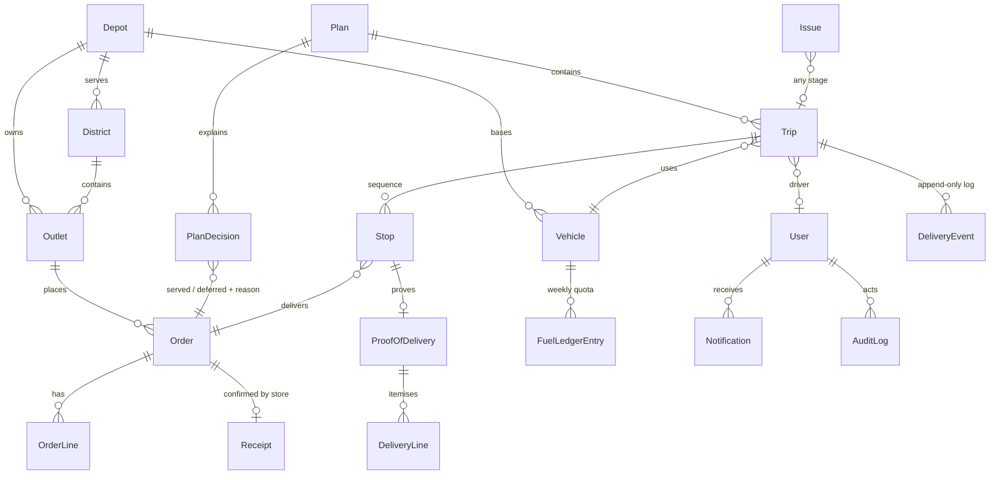

# Data model

Source of truth: [`packages/db/prisma/schema.prisma`](../packages/db/prisma/schema.prisma).

**Conventions**
- Reference data uses the dataset IDs as primary keys (`OUT001`, `VEH003`, district names).
- Operational data uses cuid primary keys plus a human-readable `ref`.
- Times of day are stored as minutes since midnight (06:30 → 390).
- Calendar dates are `@db.Date`; real instants are `timestamptz`.

| Area | Tables | Notes |
|---|---|---|
| Reference (CSV) | Depot, District, Outlet, Vehicle, ServiceAllowance, CalendarDay, TrafficSpeed, RoadCondition | Seeded unchanged from the datasets. District centroids are our own enrichment, used for maps. |
| Orders | Order, OrderLine | `requestedDate` is the date the store asked for; `deliveryDate` is the current target run. `deferCount` drives priority. |
| Planning | Plan (versioned: DRAFT → PUBLISHED → SUPERSEDED), PlanDecision, Trip, Stop | One decision row per order per plan is the **explainability record**: score breakdown, reason, explanation, source (engine or dispatcher), who overrode it. |
| Delivery | DeliveryEvent, ProofOfDelivery, DeliveryLine, MediaAsset | IDs are generated on the device, so offline replays have no side effects. |
| Exceptions | Issue, Receipt | One issue table for every stage (planning, loading, delivery, receipt). |
| Capacity | FuelLedgerEntry, DemandWeekly, DemandForecast | Weekly quota = sum of litres for a vehicle in an ISO week. A baseline forecast is seeded; the Datathon model can replace it. |
| Cross-cutting | User, Notification, AuditLog, AppSetting | `AppSetting.operatingDate` pins the demo day. |

## Changes to the Designathon schema
- `Trip.driverId`: drivers are attached to trips when the plan is published.
- `updatedAt` on Order, Trip and Issue, for offline "changed since" sync.
- `Stop.etaMin` / `etaUpdatedAt`: live ETA for store managers.
- `Outlet.lastDeliveredOn`: drives "days since last served".
